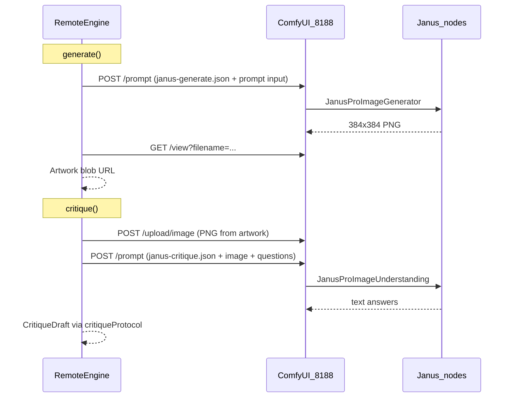

# Spec 07 — Remote Engine: ComfyUI + Janus

**Worktree:** optional — `git worktree add -b agent/remote ../adt-wt-remote main`. Can also run in
the main tree when no other agent is touching the shared seams listed below.
**Depends on:** Specs 02, 03 and 04 merged to `main`.

## Ownership zone

`remote` is already reserved in `src/lib/types/contracts.ts` (`ENGINE_IDS`, `ArtEngine`). Spec 02
deliberately left it unregistered. This spec finishes it by adding a ComfyUI-backed implementation
and wiring it into the picker.

```
New:
  src/lib/engines/remote/**
  static/comfyui/janus-generate.json      ← checked-in workflow template (generate)
  static/comfyui/janus-critique.json      ← checked-in workflow template (critique)
  src/lib/components/ComfyUISetup.svelte
  src/lib/components/ComfyUISetup.svelte.test.ts

Edit (small, targeted — exact changes in §8):
  src/lib/engines/registry.ts
  src/lib/engines/manager.ts
  src/lib/stores/engineStore.svelte.ts
  src/lib/stores/engineStore.svelte.test.ts
  src/lib/components/EnginePicker.svelte
  src/lib/components/EnginePicker.svelte.test.ts
  src/lib/components/index.ts
  src/lib/components/README.md
  src/lib/engines/README.md
  src/routes/+page.svelte
  docs/tasks/README.md
```

Do **not** edit `src/lib/types/contracts.ts`. Everything needed is already there: `remote` in
`ENGINE_IDS`, `ArtEngine`, `EngineRequirements`, `LoadProgress`. If you need a new field on a
frozen type, stop and put the request in your handoff.

---

## Mission

Let a player run **Janus-Pro on their own machine via ComfyUI** and connect the game to it — the
same unified generate-and-critique model the in-browser Janus engine uses (spec 05), but hosted
locally behind ComfyUI's HTTP API instead of downloaded into the tab.

This is the sweet spot your research found: ComfyUI custom nodes (e.g.
[ComfyUI-Janus-Pro](https://github.com/CY-CHENYUE/ComfyUI-Janus-Pro) or
[ComfyUI_Janus_Wrapper](https://github.com/chflame163/ComfyUI_Janus_Wrapper)) expose Janus text-to-image
and Janus image-to-text nodes. ComfyUI itself exposes a stable REST API at `http://localhost:8188`.
The game submits **checked-in workflow JSON** to `POST /prompt`, polls for completion, and fetches
the output image or text — no gigabyte download in the browser, no WebGPU requirement, real Janus
art and real Janus critique when the player's ComfyUI stack is running.

Pitch to the player: **"Your ComfyUI, real Janus — generate and critique on your PC."**

---

## Why ComfyUI + Janus (not Ollama / LM Studio / A1111 for spec 07)

| Approach                   | Generate                                       | Critique         | One model? | Spec 07       |
| -------------------------- | ---------------------------------------------- | ---------------- | ---------- | ------------- |
| In-browser Janus (spec 05) | Yes                                            | Yes              | Yes        | Already done  |
| **ComfyUI + Janus nodes**  | Yes (384px)                                    | Yes (vision Q&A) | **Yes**    | **This spec** |
| Ollama / LM Studio         | Separate image + vision models, different APIs | Partial          | No         | Deferred      |
| ComfyUI + SD workflow only | Yes                                            | No               | No         | Deferred      |
| Automatic1111              | Yes                                            | No               | No         | Deferred      |

Spec 07 owns **one provider**: ComfyUI running Janus. Other local programs and cloud APIs are
listed in §10 (later) — stub them in the setup UI as "Coming soon" but do not implement them.

---

## Player setup (document in README — implementer must verify)

Before the game can connect, the player needs:

1. **ComfyUI** running with CORS enabled for the game's origin.
   - Launch flag: `--enable-cors-header "*"` (or the exact origin in production).
   - Default base URL: `http://127.0.0.1:8188`.
2. **Janus-Pro ComfyUI plugin** installed (verify node class names against the checked-in
   workflows before shipping — see §3).
   - Recommended reference: `CY-CHENYUE/ComfyUI-Janus-Pro` via ComfyUI Manager ("Janus-Pro").
   - Alternative: `chflame163/ComfyUI_Janus_Wrapper` — if you use this, update the workflow
     JSON node `class_type` values to match **that** plugin's nodes instead.
3. **Janus-Pro-1B weights** on disk (player choice of 1B vs 7B is a workflow constant — default
   **1B** in the shipped templates; 7B is slower and heavier).
4. A one-time **manual smoke test** in ComfyUI's UI: load the shipped workflow files, run
   generate once and critique once, confirm nodes are wired. Record which plugin + model you
   used in the handoff.

Mixed content: if the game is served over `https://`, loopback `http://127.0.0.1:8188` is
allowed; a LAN IP on plain HTTP is not — document this in the README the same way spec 05/06
document WebGPU gates.

---

## Architecture



`RemoteEngine implements ArtEngine` — same interface as Janus and SD-Turbo. The manager never
branches on ComfyUI; only this folder knows about workflows and `/prompt`.

---

## 1. Checked-in workflow templates

**Location:** `static/comfyui/janus-generate.json` and `static/comfyui/janus-critique.json`.

These are ComfyUI **API prompt graphs** (the JSON object ComfyUI expects as the `prompt` field
in `POST /prompt`), not full `.json` workflow files with UI metadata. Export them from ComfyUI
using **Save (API Format)** after building a minimal graph with the Janus plugin.

### `janus-generate.json`

Must contain exactly these injectable inputs (implementer picks stable node ids — e.g. `"3"` for
prompt — and documents them in `workflows/README.md` inside the remote folder):

| Node role     | Expected class_type (verify at build time)  | Game overrides                                             |
| ------------- | ------------------------------------------- | ---------------------------------------------------------- |
| Model loader  | `JanusProModelLoader` or plugin equivalent  | `"model_name": "Janus-Pro-1B"`                             |
| Text-to-image | `JanusProImageGenerator` or equivalent      | `"prompt": "<built prompt from game>"`, `"seed": <number>` |
| Output        | `SaveImage` or preview node the API exposes | `"filename_prefix": "adt-generate"`                        |

Output size: **384×384** (Janus native — matches in-browser Janus, keeps Level 1 amateur scale).

### `janus-critique.json`

Two modes in one workflow file is allowed **only** if it keeps node ids stable; otherwise ship
**one workflow per question** is too heavy — instead run the critique workflow **once per keyword
question** plus **once for the prose review**, reusing the same template and swapping the
`question` input:

| Node role           | Expected class_type                                   | Game overrides                                                                 |
| ------------------- | ----------------------------------------------------- | ------------------------------------------------------------------------------ |
| Model loader        | same as generate                                      | same                                                                           |
| Image understanding | `JanusProImageUnderstanding` or `Janus Image To Text` | `"image": ["<upload_node_id>", 0]`, `"question": "<buildKeywordQuestion(kw)>"` |
| Text output         | node whose output the history API returns as string   | —                                                                              |

For the prose review, one extra call with `question = buildReviewPrompt(brief.requestText)` and
a higher token limit in the workflow (or pass through if the node exposes `max_new_tokens`).

**Critical:** Before merging, open ComfyUI, paste each template, queue once, and fix any
`class_type` / input key mismatch. Record the working plugin name and commit hash in the handoff.
This is the spec-06-equivalent "verify the model repository" step — workflows drift when plugins
rename nodes.

### Loading templates at runtime

```ts
/** Fetches the API prompt graph from static assets. Never throws — returns null on failure. */
export async function loadWorkflowTemplate(
	name: 'janus-generate' | 'janus-critique'
): Promise<Record<string, unknown> | null>;
```

Fetch `/comfyui/janus-generate.json` and `/comfyui/janus-critique.json`. Deep-clone before
mutating node inputs so the cached template stays pristine.

**Tests:** `loadWorkflowTemplate` returns an object with at least one node key for a mocked
`fetch`; returns `null` when `fetch` fails.

---

## 2. `comfyClient.ts` — the only file that calls ComfyUI

Pure HTTP; no `EngineError` here — `remoteEngine.ts` wraps failures.

```ts
export const COMFYUI_DEFAULT_BASE_URL = 'http://127.0.0.1:8188';
export const CONNECTION_TEST_TIMEOUT_MS = 6000;
export const PROMPT_TIMEOUT_MS = 120_000; // Janus gen + critique can be slow on CPU

export async function testConnection(
	baseUrl: string,
	signal?: AbortSignal
): Promise<{ ok: true } | { ok: false; reason: string }>;

/** Upload PNG bytes; returns the filename ComfyUI stored (for image input nodes). */
export async function uploadImage(
	baseUrl: string,
	pngBytes: Uint8Array,
	filename: string,
	signal?: AbortSignal
): Promise<string>;

/**
 * Queue a workflow, wait until done, return outputs.
 * Implement with POST /prompt then poll GET /history/{prompt_id} every 500ms until
 * outputs appear or PROMPT_TIMEOUT_MS elapses. Do not use WebSockets — polling is enough
 * for Level 1 and keeps tests simple.
 */
export async function runPrompt(
	baseUrl: string,
	prompt: Record<string, unknown>,
	signal?: AbortSignal
): Promise<ComfyPromptOutputs>;

/** Fetch an output image as a Blob from GET /view?filename=...&subfolder=...&type=output */
export async function fetchOutputImage(
	baseUrl: string,
	file: ComfyOutputFile,
	signal?: AbortSignal
): Promise<Blob>;
```

### `testConnection`

1. Validate URL; strip trailing slashes.
2. `GET {baseUrl}/system_stats` (or `GET {baseUrl}/` if stats is unavailable — pick one and
   document it). Timeout via `AbortSignal.timeout(CONNECTION_TEST_TIMEOUT_MS)`.
3. Success → `{ ok: true }`.
4. Any failure → `{ ok: false, reason: 'Could not reach ' + baseUrl + '. Is ComfyUI running with CORS enabled? (--enable-cors-header)' }`.

Do not conflate CORS failure with "ComfyUI down" — use the same dual-message pattern as the
draft Ollama spec.

### `runPrompt` output parsing

ComfyUI history entries look like `{ outputs: { [nodeId]: { images?: [...], text?: [...] } } }`.
Define a small zod schema for the slice you need; never cast the full history blob.

For **generate**, read the SaveImage node's `images[0]`.
For **critique**, read the text output node's string (plugin-dependent — verify once, document
the node id in `workflows/README.md`).

**Tests (`comfyClient.test.ts`, Node, stubbed `fetch`):** `testConnection` ok/fail paths;
`runPrompt` resolves when history returns outputs; rejects on timeout; `uploadImage` posts
multipart and returns filename from JSON `{ name: string }`.

---

## 3. `remoteConfig.ts`

```ts
export const remoteEngineConfigSchema = z.object({
	baseUrl: z
		.string()
		.url()
		.transform((url) => url.replace(/\/+$/, '')),
	/** Janus variant baked into workflow — player may override if they use 7B */
	modelName: z.enum(['Janus-Pro-1B', 'Janus-Pro-7B']).default('Janus-Pro-1B')
});

export type RemoteEngineConfig = z.infer<typeof remoteEngineConfigSchema>;
```

Storage key: `'adt.engine.remote.config'`. `loadRemoteConfig` / `saveRemoteConfig` — same
discipline as the draft spec (safeParse on load, never throw from storage).

**Tests:** round-trip; malformed → null; trailing slash stripped.

---

## 4. `workflowBuilder.ts`

Pure functions that take a loaded template + runtime inputs and return the `prompt` object for
`runPrompt`.

```ts
export const GENERATE_PROMPT_NODE_ID = '...'; // set after workflow is verified
export const GENERATE_SEED_NODE_ID = '...';
export const CRITIQUE_QUESTION_NODE_ID = '...';
export const CRITIQUE_IMAGE_INPUT_NODE_ID = '...';

export function buildGeneratePrompt(
	template: Record<string, unknown>,
	input: { prompt: string; seed: number; modelName: string }
): Record<string, unknown>;

export function buildCritiquePrompt(
	template: Record<string, unknown>,
	input: { uploadedImageFilename: string; question: string; modelName: string }
): Record<string, unknown>;
```

Deep-clone the template, mutate only the documented node input slots. **Never** send
`playerPrompt` to ComfyUI — only the built `prompt` with Level 1 modifiers (same rule as Janus
in-browser).

**Tests:** built prompt contains the generation string and seed; critique prompt references the
uploaded filename and question; template object is not mutated (assert referential inequality of
nested inputs).

---

## 5. `remoteEngine.ts`

```ts
export class RemoteEngine implements ArtEngine {
	readonly id = 'remote' as const;
	readonly displayName = 'ComfyUI · Janus';
	readonly description =
		'Real Janus art via your local ComfyUI. No browser download — you run the model.';
	readonly requirements = {
		webgpu: false,
		approxDownloadMb: 0,
		minStorageBufferMb: 0,
		desktopOnly: false // ComfyUI can run on a beefy phone in theory; do not gate mobile
	};
	readonly capabilities = { generate: true, critique: true };
}
```

### `probe(capability)`

Ignore hardware capability. `loadRemoteConfig()` → if null,
`{ available: false, reason: 'Not connected. Set up ComfyUI in the engine menu.' }`.
Else `testConnection(config.baseUrl)` → map to
`{ available: true, requiresDownload: false, approxDownloadMb: 0 }` or unavailable with reason.

### `load(options)`

Re-test connection; throw `EngineError('internal', reason)` on failure (manager falls back to mock).
Cache config and pre-fetch both workflow templates; if either template fails to load, throw with a
player-safe message. Emit one `LoadProgress` `{ status: 'ready', fraction: 1, ... }` if
`onProgress` is provided.

### `generate({ playerPrompt, prompt, seed, signal })`

1. `seed ??= hashString(prompt)` (reuse `$lib/engines/random`).
2. `buildGeneratePrompt(template, { prompt, seed, modelName })`.
3. `runPrompt` → `fetchOutputImage` → `bitmapToObjectUrl` (reuse
   `$lib/engines/janus/imageConversion` — import only, do not edit janus folder).
4. Return `Artwork` with `width: 384`, `height: 384`, `engineId: 'remote'`,
   **`playerPrompt` verbatim**, unique `id`, `generationMs` measured.
5. Cache `ImageBitmap` or PNG bytes keyed by artwork id for critique (same pattern as
   `JanusEngine` bitmap cache).
6. Track object URLs; revoke in `unload()`.
7. Wrap errors with `toEngineError(..., 'generation_failed')`.

### `critique({ brief, playerPrompt, artwork, signal })`

Same protocol as [`janusEngine.ts`](../src/lib/engines/janus/janusEngine.ts):

1. Up to **four** keyword questions via `buildKeywordQuestion`.
2. `buildReviewPrompt(brief.requestText)` for prose.
3. Rasterize artwork to PNG if needed (`urlToBitmap` → canvas → bytes, or reuse cached bytes).
4. `uploadImage` once; reuse filename for all questions in the batch.
5. Sequential `runPrompt` calls — one per question, then one for review. **Do not** parallelize;
   ComfyUI queues are single-threaded by default and concurrent prompts race.
6. `parseYesNo`, `accuracyFromHits`, `buildTitle`, `cleanReview`, template fallback — identical
   to Janus engine.
7. Wrap with `toEngineError(..., 'critique_failed')`.

### `unload()`

Revoke object URLs, clear caches, drop config reference.

**Tests (`remoteEngine.test.ts`, Node):** inject fake `comfyClient` module or pass deps struct;
cover probe unavailable/available; generate returns schema-valid Artwork with correct
`playerPrompt` and 384×384; critique maps four `'yes'` → accuracy 10; empty review → fallback;
no real network.

---

## 6. `ComfyUISetup.svelte`

Presentational setup dialog (replaces the draft `RemoteEngineSetup` name — ComfyUI is the only
provider in spec 07).

| Prop        | Type                                             | Notes                                    |
| ----------- | ------------------------------------------------ | ---------------------------------------- |
| `baseUrl`   | `string` (`$bindable`)                           |                                          |
| `modelName` | `'Janus-Pro-1B' \| 'Janus-Pro-7B'` (`$bindable`) |                                          |
| `testState` | `'idle' \| 'testing' \| 'success' \| 'error'`    |                                          |
| `testError` | `string \| null`                                 |                                          |
| `on test`   | `() => void`                                     |                                          |
| `onconnect` | `() => void`                                     | Disabled until `testState === 'success'` |
| `oncancel`  | `() => void`                                     |                                          |

Contents:

- Short explanation: requires ComfyUI + Janus-Pro plugin; link to README section for install steps.
- Base URL input + "Use default (`127.0.0.1:8188`)" button.
- Model size radio: 1B (recommended) / 7B.
- Test connection button.
- Collapsible "Setup help" with CORS flag and ComfyUI Manager plugin name.
- **Coming soon** (disabled, greyed): OpenRouter, OpenAI BYO key, Art Dev Tycoon Cloud, BAGEL
  sketch mode — labels only, no handlers.
- Connect / Cancel.

**Tests:** same discipline as draft spec — bindable fields, connect disabled until success,
`ontest`/`onconnect`/`oncancel` fire, accessible labels.

---

## 7. Store and page wiring

Extend [`engineStore.svelte.ts`](../src/lib/stores/engineStore.svelte.ts):

- `remoteBaseUrl`, `remoteModelName`, `remoteTestState`, `remoteTestError`
- `testRemoteConnection()` → `testConnection(remoteBaseUrl)`
- `connectRemote()` → validate config, `saveRemoteConfig`, `select('remote')`
- Widen local `readStoredEngineId` whitelist to include `'remote'`

[`EnginePicker.svelte`](../src/lib/components/EnginePicker.svelte): optional `onconfigure(id)`.
For `id === 'remote'`, show **"Set up ComfyUI"** / **"Change ComfyUI server"** button (same
stopPropagation pattern as draft spec).

[`+page.svelte`](../src/routes/+page.svelte): render `ComfyUISetup` overlay when
`showRemoteSetup`; no `ModelDownloadGate` for this engine (`requiresDownload` is always false).

[`registry.ts`](../src/lib/engines/registry.ts):

```ts
{
  id: 'remote',
  displayName: 'ComfyUI · Janus',
  description: 'Real Janus via your local ComfyUI. You run the model.',
  requirements: { webgpu: false, approxDownloadMb: 0, minStorageBufferMb: 0, desktopOnly: false },
  tier: 1, // same tier as in-browser Janus — also real Janus, also unified gen+critique
  create: async () => new (await import('./remote/remoteEngine')).RemoteEngine()
}
```

[`manager.ts`](../src/lib/engines/manager.ts): add `'remote'` to `isEngineId` and
`readStoredEngineId` whitelists.

---

## 8. Manual verification

With ComfyUI + Janus-Pro plugin running locally:

1. Open engine menu → **ComfyUI · Janus** → Set up ComfyUI.
2. Test connection → Connect.
3. Complete one commission: 384×384 image, critique prose that reflects the picture (not mock
   templates), `playerPrompt` unchanged in results UI.
4. Stop ComfyUI, start a commission, confirm fallback to mock without a dead-end.
5. Record wall-clock generate time, critique time, plugin version, and model size in handoff.

---

## 9. Definition of done

- [ ] Workflow JSON files exist under `static/comfyui/` and were verified against a real ComfyUI +
      Janus plugin install.
- [ ] `RemoteEngine` generates 384×384 art and critiques via ComfyUI — no `MockEngine` compose.
- [ ] `playerPrompt` never equals built `prompt` in returned `Artwork`.
- [ ] CORS / reachability errors are player-safe and mention both causes.
- [ ] No test hits the network; fakes inject all ComfyUI calls.
- [ ] `npm run check`, `npm run lint`, `npm run test:unit -- --run` green.
- [ ] `src/lib/engines/remote/README.md` with full player setup guide.
- [ ] Handoff entry in `docs/agent-log.md` with plugin name, timings, workflow node ids.

---

## 10. Later features (do not implement in spec 07)

Stub task specs exist for each track — expand those before implementing:

| Spec | Doc                                                | Notes                                                                      |
| ---- | -------------------------------------------------- | -------------------------------------------------------------------------- |
| 08   | [`08-local-providers.md`](./08-local-providers.md) | Ollama, LM Studio, ComfyUI+SD, A1111 — **generate model + critique model** |
| 09   | [`09-byo-api.md`](./09-byo-api.md)                 | OpenRouter, OpenAI — API key + **two models**                              |
| 10   | [`10-adt-cloud.md`](./10-adt-cloud.md)             | Your hosted service, credits, accounts                                     |
| 11   | [`11-bagel-sketch.md`](./11-bagel-sketch.md)       | Sketch canvas → BAGEL edit + critique model                                |

Spec 07 only needs greyed **"Coming soon"** labels in `ComfyUISetup` — no provider code yet.

---

## Files to create (summary)

| File                                             | Contents                                 |
| ------------------------------------------------ | ---------------------------------------- |
| `static/comfyui/janus-generate.json`             | API prompt graph for Janus text-to-image |
| `static/comfyui/janus-critique.json`             | API prompt graph for Janus image-to-text |
| `src/lib/engines/remote/remoteConfig.ts`         | Zod config + localStorage                |
| `src/lib/engines/remote/remoteConfig.test.ts`    |                                          |
| `src/lib/engines/remote/comfyClient.ts`          | HTTP client                              |
| `src/lib/engines/remote/comfyClient.test.ts`     |                                          |
| `src/lib/engines/remote/workflowBuilder.ts`      | Template mutation                        |
| `src/lib/engines/remote/workflowBuilder.test.ts` |                                          |
| `src/lib/engines/remote/loadWorkflow.ts`         | Fetch static templates                   |
| `src/lib/engines/remote/loadWorkflow.test.ts`    |                                          |
| `src/lib/engines/remote/remoteEngine.ts`         | `ArtEngine`                              |
| `src/lib/engines/remote/remoteEngine.test.ts`    |                                          |
| `src/lib/engines/remote/workflows/README.md`     | Node ids, plugin version used            |
| `src/lib/engines/remote/README.md`               | Player + dev guide                       |
| `src/lib/components/ComfyUISetup.svelte`         | Setup dialog                             |
| `src/lib/components/ComfyUISetup.svelte.test.ts` |                                          |
