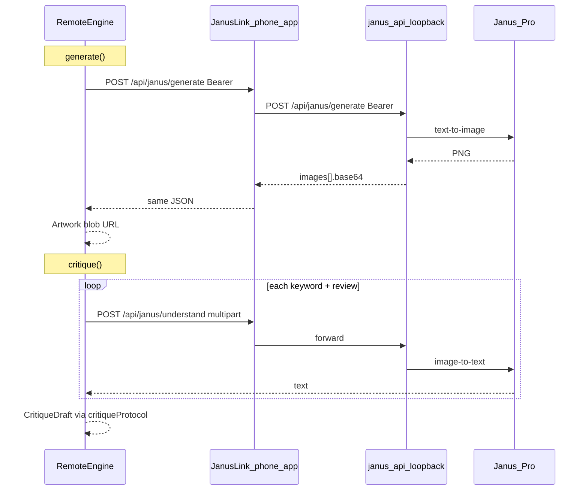

# Spec 07 — Remote Engine: JanusLink (My PC)

**Worktree:** optional — `git worktree add -b agent/remote ../adt-wt-remote main`. Can also run in
the main tree when no other agent is touching the shared seams listed below.
**Depends on:** Specs 02, 03 and 04 merged to `main`.
**Companion repo:** [MichaelTJ/ADTLocalServe](https://github.com/MichaelTJ/ADTLocalServe) (JanusLink) —
local FastAPI + Tailscale phone-app host for Janus-Pro. Not vendored into this repo.

## Ownership zone

`remote` is already reserved in `src/lib/types/contracts.ts` (`ENGINE_IDS`, `ArtEngine`). Spec 02
left it unregistered. This spec registers it as the **My PC** engine: the game talks to the
player's JanusLink install over HTTPS (Tailscale), with no WebGPU and no model download in the tab.

```
New:
  src/lib/engines/remote/**
  src/lib/components/MyPcSetup.svelte
  src/lib/components/MyPcSetup.svelte.test.ts

Edit (small, targeted — exact changes in §7):
  src/lib/engines/registry.ts
  src/lib/engines/manager.ts
  src/lib/engines/README.md
  src/lib/stores/engineStore.svelte.ts
  src/lib/stores/engineStore.svelte.test.ts
  src/lib/components/EnginePicker.svelte
  src/lib/components/EnginePicker.svelte.test.ts
  src/lib/components/index.ts
  src/lib/components/README.md
  src/routes/+page.svelte
  docs/tasks/README.md
  docs/architecture.md          ← orchestrator: remote tier row only
  src/lib/types/contracts.ts    ← orchestrator: comment on `remote` only (id stays `remote`)
```

Do **not** add `+server.ts`, `$lib/server/**`, or change `adapter-static`. The game stays a static
bundle. Do **not** copy ADTLocalServe's `game-integration/` drop-in as-is — it assumes a Node
game server on the GPU PC. Reimplement the client against `ArtEngine` instead.

---

## Mission

Let a player run **Janus-Pro on their home GPU via JanusLink** and select it from the engine
picker — same unified generate-and-critique model as in-browser Janus (spec 05), but hosted on
their PC behind Tailscale instead of downloaded into the tab.

Pitch: **"My PC — real Janus on your GPU. No WebGPU, no browser download."**

ComfyUI is **not** the path. JanusLink exists because ComfyUI's bundled PyTorch does not support
common Pascal GPUs (e.g. GTX 1060 / `sm_61`), and the old Comfy → nodes → proxy → Tailscale flow
was too fragile. Specs 08+ still cover other local/cloud providers later.

---

## Why JanusLink (not ComfyUI / Ollama for spec 07)

| Approach                   | Generate | Critique | One model? | Spec 07       |
| -------------------------- | -------- | -------- | ---------- | ------------- |
| In-browser Janus (spec 05) | Yes      | Yes      | Yes        | Already done  |
| **JanusLink (My PC)**      | Yes      | Yes      | **Yes**    | **This spec** |
| ComfyUI + Janus nodes      | Yes      | Yes      | Yes        | Superseded    |
| Ollama / LM Studio         | Split    | Partial  | No         | Spec 08       |
| BYO OpenRouter / OpenAI    | Split    | Split    | No         | Spec 09       |

---

## Player setup (document in `src/lib/engines/remote/README.md`)

1. Install and run **JanusLink** on the GPU PC
   ([ADTLocalServe](https://github.com/MichaelTJ/ADTLocalServe) — `installer/install.ps1` or manual
   `janus-api` + `phone-app`).
2. Join the phone/laptop to the **same Tailscale** tailnet.
3. On the PC, set `phone-app` env:
   ```
   JANUS_ALLOWED_ORIGINS=http://localhost:5173,https://your-game-host.example
   ```
   (include every origin that serves the game).
4. Copy the **Tailscale HTTPS base URL** (e.g. `https://pc-name.tailnet-xxxx.ts.net`) and the
   **`JANUS_API_KEY`** from the installer / `.env` into the game's My PC setup dialog.
5. Test connection → Connect. Generate and critique use Bearer auth from the browser; the raw key
   never leaves the player's machine except to their own JanusLink host.

**Auth choice (load-bearing):** JanusLink session cookies are `SameSite=lax`, so they are **not**
sent on cross-origin `fetch` from a static game host. Spec 07 therefore uses
`Authorization: Bearer <JANUS_API_KEY>` only. Cookie/QR pairing remains how phones use JanusLink's
own UI; the game does not mint pairing tokens and does not add server routes.

**CORS:** `phone-app` already CORS-enables `/api/janus/*` for origins in `JANUS_ALLOWED_ORIGINS`
(see ADTLocalServe `hooks.server.js`). Without that allowlist entry, the browser blocks the game.

---

## Architecture



`RemoteEngine implements ArtEngine`. Nothing outside `src/lib/engines/remote/**` knows about
JanusLink URLs or Bearer headers.

---

## 1. `remoteConfig.ts`

```ts
export const REMOTE_CONFIG_STORAGE_KEY = 'adt.engine.remote.config';

export const remoteEngineConfigSchema = z.object({
	baseUrl: z
		.string()
		.url()
		.transform((url) => url.replace(/\/+$/, '')),
	/** JanusLink JANUS_API_KEY — player's own secret for their PC. */
	apiKey: z.string().min(24).max(256)
});

export type RemoteEngineConfig = z.infer<typeof remoteEngineConfigSchema>;

export function loadRemoteConfig(): RemoteEngineConfig | null;
export function saveRemoteConfig(config: RemoteEngineConfig): void;
export function clearRemoteConfig(): void;
```

- `loadRemoteConfig`: `JSON.parse` + `safeParse`; malformed → `null`; never throw.
- `saveRemoteConfig`: validate then write.
- Strip trailing slashes on `baseUrl`.

**Tests:** round-trip; malformed → null; trailing slash stripped; missing apiKey → null.

---

## 2. `janusLinkClient.ts` — the only file that calls JanusLink

Pure HTTP. No `EngineError` here — `remoteEngine.ts` wraps failures.

```ts
export const CONNECTION_TEST_TIMEOUT_MS = 6000;
export const REQUEST_TIMEOUT_MS = 180_000; // home GPU / cold start can be slow

export interface JanusLinkClientDeps {
	fetch?: typeof fetch;
}

export function createJanusLinkClient(deps?: JanusLinkClientDeps): {
	testConnection(
		config: RemoteEngineConfig,
		signal?: AbortSignal
	): Promise<{ ok: true; device?: string } | { ok: false; reason: string }>;
	generate(
		config: RemoteEngineConfig,
		body: { prompt: string; seed?: number },
		signal?: AbortSignal
	): Promise<JanusGenerateResult>;
	understand(
		config: RemoteEngineConfig,
		body: { image: Blob; question: string; filename?: string },
		signal?: AbortSignal
	): Promise<JanusUnderstandResult>;
};
```

### Response schemas (zod — trust boundary)

```ts
export const janusGenerateResultSchema = z.object({
	promptId: z.string().min(1),
	images: z
		.array(
			z.object({
				filename: z.string().optional(),
				mimeType: z.string().min(1),
				base64: z.string().min(1)
			})
		)
		.min(1)
});

export const janusUnderstandResultSchema = z.object({
	promptId: z.string().min(1),
	text: z.string()
});

export const janusHealthResultSchema = z.object({
	ok: z.literal(true),
	device: z.string().optional(),
	dtype: z.string().optional(),
	modelDir: z.string().optional(),
	version: z.string().optional()
});
```

Match ADTLocalServe `docs/SPEC.md` §2–3 (phone-app forwards the same shapes).

### Request rules

1. `GET {baseUrl}/api/janus/health` with `Authorization: Bearer {apiKey}`.
2. `POST {baseUrl}/api/janus/generate` JSON `{ prompt, seed? }` — camelCase as in SPEC.
3. `POST {baseUrl}/api/janus/understand` `multipart/form-data` fields `image`, `question`.
4. **Do not** send `credentials: 'include'` (Bearer only).
5. On non-OK: prefer `{ error: string }` body message; else status text.
6. Player-safe failure for unreachable / CORS:
   `'Could not reach ' + baseUrl + '. Is JanusLink running? Is this game origin in JANUS_ALLOWED_ORIGINS on the PC?'`

**Tests (`janusLinkClient.test.ts`, Node, stubbed `fetch`):** health ok/fail; generate parses
base64 image; understand returns text; 401 → reason; network throw → CORS/reachability message;
invalid JSON → fail closed.

---

## 3. `remoteEngine.ts`

```ts
export class RemoteEngine implements ArtEngine {
	readonly id = 'remote' as const;
	readonly displayName = 'My PC';
	readonly description =
		'Real Janus on your home GPU via JanusLink. No browser download — you run the model.';
	readonly requirements = {
		webgpu: false,
		approxDownloadMb: 0,
		minStorageBufferMb: 0,
		desktopOnly: false
	};
	readonly capabilities = { generate: true, critique: true };
}

export interface RemoteEngineDeps {
	client?: ReturnType<typeof createJanusLinkClient>;
	loadConfig?: () => RemoteEngineConfig | null;
}
```

### `probe(_capability)`

Ignore device capability (no WebGPU gate).

1. `loadRemoteConfig()` → if null:
   `{ available: false, reason: 'Not connected. Set up My PC (JanusLink) in the engine menu.' }`
2. Else `testConnection(config)` with a short timeout → available
   `{ available: true, requiresDownload: false, approxDownloadMb: 0 }` or unavailable with reason.

### `load(options)`

Re-load config; re-test connection; throw `EngineError('internal', reason)` on failure.
Emit one `LoadProgress` `{ status: 'ready', fraction: 1, file: null, loadedBytes: 0, totalBytes: 0 }`
if `onProgress` is provided. Cache the config on the instance.

### `generate({ playerPrompt, prompt, seed, signal })`

1. `seed ??= hashString(prompt)` from `$lib/engines/random`.
2. Call client `generate` with **`prompt` only** (never `playerPrompt`).
3. Decode first image base64 → `Blob` → `URL.createObjectURL`; track URL for `unload`.
4. Optionally `createImageBitmap` for width/height; default **384×384** if unavailable.
5. Cache `Blob` (and/or bitmap) by artwork id for critique.
6. Return `artworkSchema.parse({ id, imageUrl, playerPrompt: input.playerPrompt, width, height,
generationMs, engineId: 'remote' })`.
7. Wrap with `toEngineError(..., 'generation_failed')`.

### `critique({ brief, playerPrompt, artwork, signal })`

Mirror [`janusEngine.ts`](../../src/lib/engines/janus/janusEngine.ts) scoring — same
`critiqueProtocol` helpers:

1. Up to **four** keywords → `buildKeywordQuestion`.
2. `buildReviewPrompt(brief.requestText)` for prose.
3. Resolve image `Blob` from cache, else `fetch(artwork.imageUrl)` → blob.
4. Sequential `understand` calls — one per keyword question, then one for review.
   **Do not** parallelize (home GPU + rate limits).
5. `parseYesNo` → `accuracyFromHits` → `buildTitle(playerPrompt, hashString(artwork.id))` →
   `cleanReview` with the same mock-template fallback pattern Janus uses.
6. Wrap with `toEngineError(..., 'critique_failed')`.

### `unload()`

Revoke object URLs; clear blob/bitmap caches; drop cached config.

**Tests (`remoteEngine.test.ts`, Node):** inject fake client + config loader; probe
unavailable/available; generate returns schema-valid Artwork with correct `playerPrompt` and
`engineId: 'remote'`; critique four `'yes'` → accuracy 10; empty review → fallback; no real
network.

---

## 4. `MyPcSetup.svelte`

Presentational setup dialog (stone/amber styling consistent with `EnginePicker`).

| Prop        | Type                                          | Notes                                    |
| ----------- | --------------------------------------------- | ---------------------------------------- |
| `baseUrl`   | `string` (`$bindable`)                        |                                          |
| `apiKey`    | `string` (`$bindable`)                        | password-style input                     |
| `testState` | `'idle' \| 'testing' \| 'success' \| 'error'` |                                          |
| `testError` | `string \| null`                              |                                          |
| `ontest`    | `() => void`                                  |                                          |
| `onconnect` | `() => void`                                  | Disabled until `testState === 'success'` |
| `oncancel`  | `() => void`                                  |                                          |

Contents:

- Short explanation: install JanusLink on the PC; Tailscale; paste URL + API key.
- Base URL input (placeholder `https://your-pc.tailnet-xxxx.ts.net`).
- API key input (`type="password"`, autocomplete off).
- Collapsible setup help: `JANUS_ALLOWED_ORIGINS`, installer pointer to ADTLocalServe README.
- Test connection / Connect / Cancel.
- Greyed **Coming soon**: OpenRouter, OpenAI, Art Dev Tycoon Cloud (labels only).

**Tests:** bindable fields; connect disabled until success; `ontest`/`onconnect`/`oncancel` fire;
accessible labels (`getByLabelText` / roles).

---

## 5. Store and page wiring

### `engineStore.svelte.ts`

- Widen local `readStoredEngineId` to include `'remote'`.
- Add:
  - `showRemoteSetup = $state(false)`
  - `remoteBaseUrl`, `remoteApiKey`, `remoteTestState`, `remoteTestError`
  - `openRemoteSetup()` / `closeRemoteSetup()`
  - `testRemoteConnection()` → `createJanusLinkClient().testConnection(...)`
  - `connectRemote()` → validate + `saveRemoteConfig` + `select('remote')` + close setup

### `EnginePicker.svelte`

Optional `onconfigure?: (id: string) => void`.

For `option.id === 'remote'`, render a button **"Set up My PC"** / **"Change My PC server"**
(stopPropagation so it does not select). Call `onconfigure('remote')`. Show even when the option
is unavailable so first-time setup works.

### `+page.svelte`

- Pass `onconfigure` → `engines.openRemoteSetup()`.
- In `handleEngineSelect`: if `id === 'remote'` and option unavailable → open setup instead of
  no-op (belt and suspenders with the configure button).
- Render `MyPcSetup` overlay when `engines.showRemoteSetup`.
- No `ModelDownloadGate` for remote (`requiresDownload` is always false).
- Soften capability notice fallback copy so it mentions My PC, not only WebGPU.

### `registry.ts`

```ts
{
  id: 'remote',
  displayName: 'My PC',
  description: 'Real Janus on your home GPU via JanusLink. You run the model.',
  requirements: { webgpu: false, approxDownloadMb: 0, minStorageBufferMb: 0, desktopOnly: false },
  tier: 1, // same tier as in-browser Janus — real Janus, unified gen+critique
  create: async () => new (await import('./remote/remoteEngine')).RemoteEngine()
}
```

### `manager.ts`

Add `'remote'` to `isEngineId` and `readStoredEngineId` whitelists.

---

## 6. Manual verification

With JanusLink running and the game origin allowlisted:

1. Engine menu → **My PC** → Set up My PC.
2. Paste Tailscale URL + API key → Test → Connect.
3. Complete one commission: real image, critique prose that reflects the picture, `playerPrompt`
   unchanged in results UI.
4. Stop JanusLink / use a wrong key → start a commission → confirm fallback to mock, no dead-end.
5. Record wall-clock generate/critique times and JanusLink version in the handoff.

---

## 7. Definition of done

- [ ] `RemoteEngine` generates and critiques via JanusLink HTTP — no `MockEngine` compose for the
      happy path.
- [ ] `playerPrompt` never equals built `prompt` in returned `Artwork`.
- [ ] No `+server.ts` / `$lib/server` added to this game.
- [ ] CORS / reachability errors are player-safe and mention `JANUS_ALLOWED_ORIGINS`.
- [ ] No test hits the real network; fakes inject all HTTP.
- [ ] `npm run check`, `npm run lint`, `npm run test:unit -- --run` green for owned files.
- [ ] `src/lib/engines/remote/README.md` with full player setup guide.
- [ ] Handoff entry in `docs/agent-log.md`.

---

## 8. Later features (do not implement in spec 07)

| Spec | Doc                                                | Notes                                                     |
| ---- | -------------------------------------------------- | --------------------------------------------------------- |
| 08   | [`08-local-providers.md`](./08-local-providers.md) | Ollama, LM Studio, ComfyUI+SD, A1111 — split gen/critique |
| 09   | [`09-byo-api.md`](./09-byo-api.md)                 | OpenRouter, OpenAI — API key + two models                 |
| 10   | [`10-adt-cloud.md`](./10-adt-cloud.md)             | Hosted service, credits, accounts                         |
| 11   | [`11-bagel-sketch.md`](./11-bagel-sketch.md)       | Sketch → BAGEL edit + critique model                      |

Greyed **"Coming soon"** labels in `MyPcSetup` only — no provider code yet.

---

## Files to create (summary)

| File                                             | Contents                    |
| ------------------------------------------------ | --------------------------- |
| `src/lib/engines/remote/remoteConfig.ts`         | Zod config + localStorage   |
| `src/lib/engines/remote/remoteConfig.test.ts`    |                             |
| `src/lib/engines/remote/janusLinkClient.ts`      | HTTP client + zod responses |
| `src/lib/engines/remote/janusLinkClient.test.ts` |                             |
| `src/lib/engines/remote/remoteEngine.ts`         | `ArtEngine`                 |
| `src/lib/engines/remote/remoteEngine.test.ts`    |                             |
| `src/lib/engines/remote/README.md`               | Player + dev guide          |
| `src/lib/components/MyPcSetup.svelte`            | Setup dialog                |
| `src/lib/components/MyPcSetup.svelte.test.ts`    |                             |
